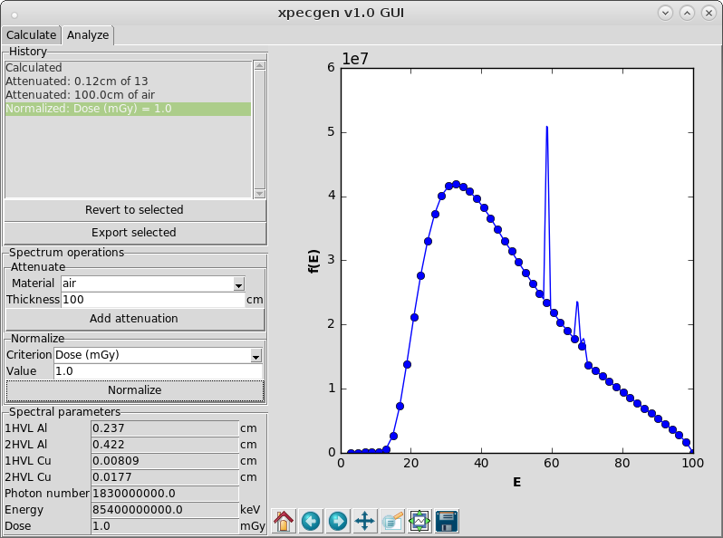

# Summary

xpecgen is a python package to calculate x-ray spectra generated in tungsten anodes using the model of Hernández and Fernández (@hernandez:2016). It includes a Graphical User Interface and allows calculation of half-value-layers, norms, and attenuation. It can also export the calculations in XLSX and CSV formats.

-

# References
